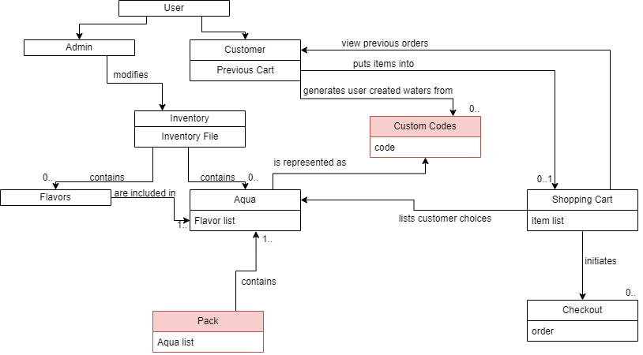
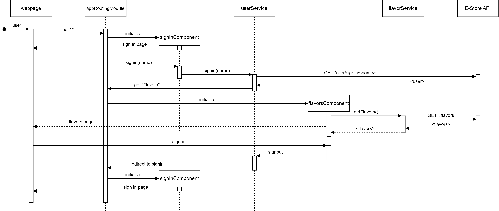
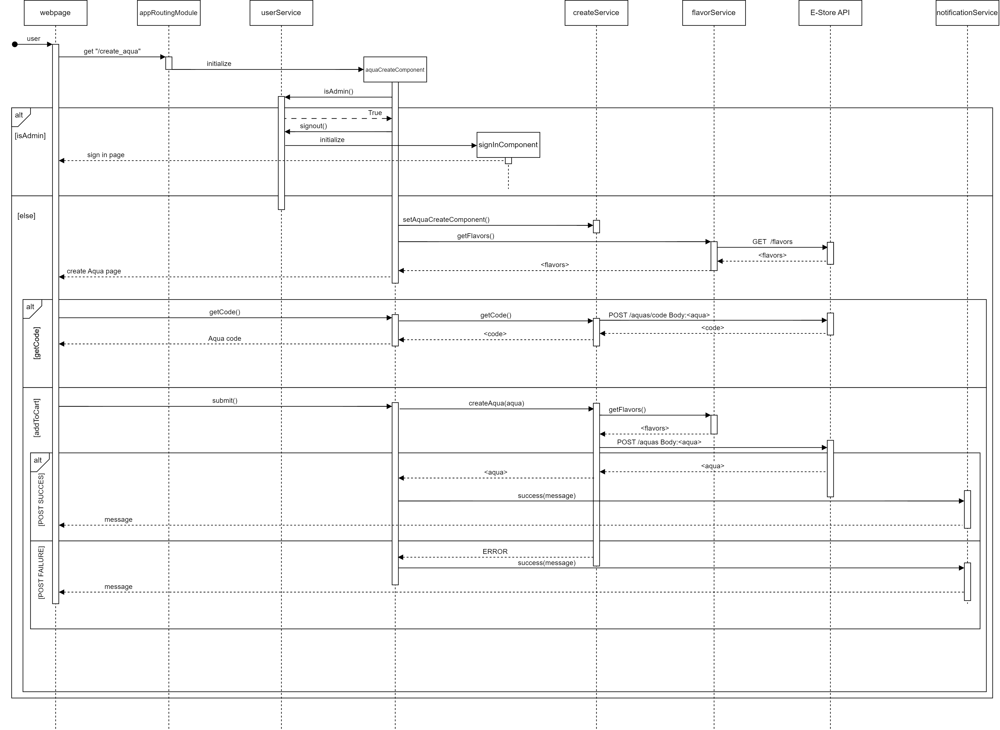
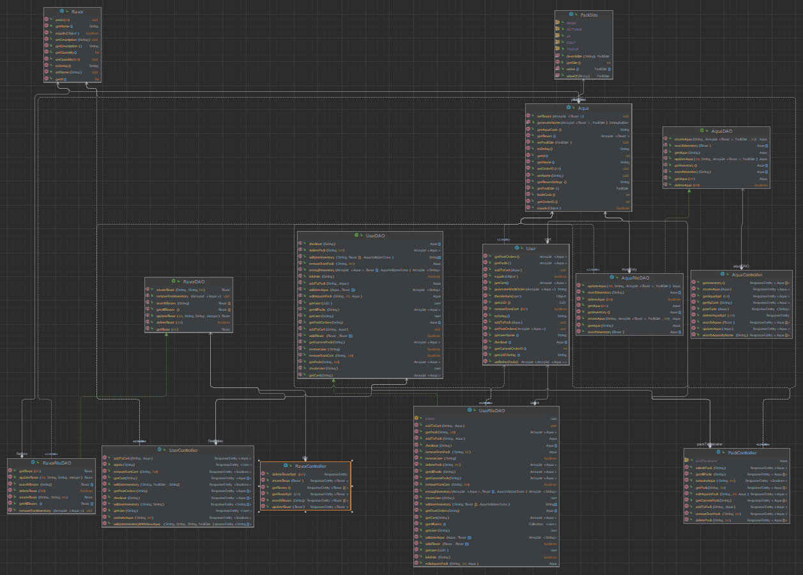
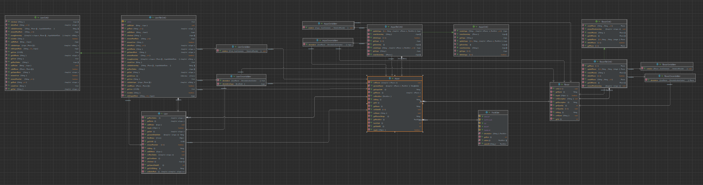
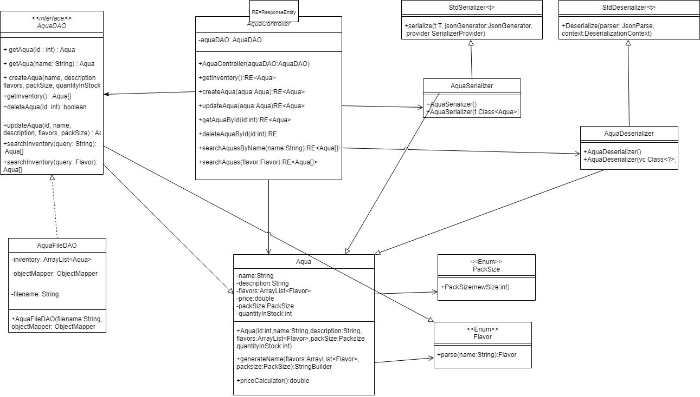
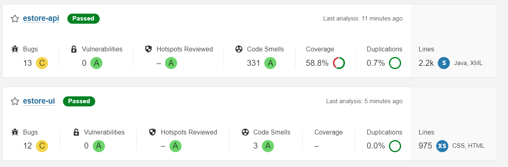
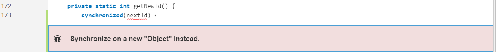
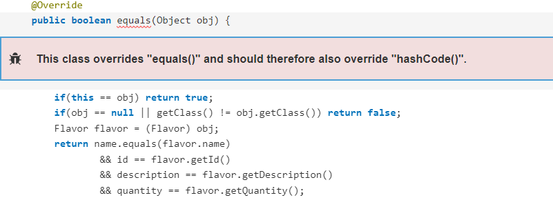
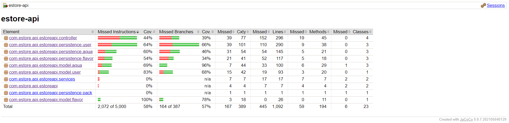

# PROJECT Design Documentation
## Team Information
* Team name: Aqua Vybes
* Team members
  * Danny G
  * Rafael G
  * Jordan Q
  * Andy W
  * Gavin H

## Executive Summary

This project is an E-commerce store designed for a small flavored water business. Written using custom software to meet custom workflow demands from the Product Owner to both meet the MVP and also fulfill the 10% enhancement features.

### Purpose
The most important groups of users are the customers and the admin. Anyone signed in with the reserved admin username is assumed to be an admin and needs administrative access to various aspects of the site in order to adjust the product inventory, ie. create, delete or change products. The other group of users are the customers, which create there own custom aquas, that are added to a customer's cart and the order can be finalized.

### Glossary and Acronyms

| Term | Definition |
|------|------------|
| Aqua | the name of our water |
| DAO | Data Access Object |
| MVP | Minimum Viable Product | 
| MVVM | Model-View-ViewModel |
| SPA | Single Page |

## Requirements

A user can log in or out to the application.  An e-store owner logs in using the reserved username admin.  Any other username can be assumed to be a customer.

A customer should be able to search for a product.  A customer should be able to add or remove a product from their shopping cart.

An e-store owner can add, remove, and edit the product data in the inventory.  An e-store owner should not have access to a shopping cart.

### Definition of MVP

The MVP will have login/logout functionalities, customer functionality such as searching for products, listing all products, adding or removing products from their shopping cart as well as the ability to proceed to checkout the items in the cart. The MVP will also contain an inventory management system for the E-Store owners, as well as data persistence using a file system rather than dealing with the complexity of a database.  

### MVP Features
* Get Inventory
* Get Product
* Search Inventory
* Delete Product
* Create Product
* Update Product
* User Login
* Admin Login
* Shopping Cart 

### Enhancements

For this project, we implemented the following enhancements:
1. Creation and sharing of custom Aquas.
When a customer goes to add an Aqua to their cart or to a custom pack, they are presented with two options. Option One is creating a new Aqua from scratch, and Option Two is loading one from a code. If they choose to create a new one, they create a name and select flavors. Additionally, they are presented with an option to generate a sharing code for the custom Aqua they just created. This code can be entered into the section under Option Two from the menu.

2. Creation of a mix-and-match six packs of Aquas.
On the website's navigation bar, there is an option, "Pack", that brings the user to a screen allowing them to create a custom six-pack of Aquas. They can create new Aquas to add or they can load them from a sharing code. Once they add six of them, they can then add it to their cart and check out as normal.

## Application Domain

This section describes the application domain.

## Architecture and Design

This section describes the application architecture.

### Summary

The following Tiers/Layers model shows a high-level view of the webapp's architecture.

The e-store web application, is built using the Model–View–ViewModel (MVVM) architecture pattern. 

The Model stores the application data objects including any functionality to provide persistance. 

The View is the client-side SPA built with Angular utilizing HTML, CSS and TypeScript. The ViewModel provides RESTful APIs to the client (View) as well as any logic required to manipulate the data objects from the Model.

Both the ViewModel and Model are built using Java and Spring Framework. Details of the components within these tiers are supplied below.

### Overview of User Interface

This section describes the web interface flow; this is how the user views and interacts
with the e-store application.

### View Tier
The View tier of the project architecture consists of the website that the user or admin interacts with.

Whenever a user, for example, navigates to the website, they are prompted to login. If they attempt to login as a user that does not exist, a new user account is created for them. They are then brought straight to the Aqua creation page. They are prompted to create or load an Aqua. Both of these options bring up forms allowing the users to edit their Aquas to their taste before adding them to the user's cart. The user can also create a custom six-pack of Aquas if they click on the "Pack" link in the website's navigation bar. This brings them to the same Aqua creation screen but in the context of adding a single bottle of each Aqua to a six-pack. If a user wishes to see the stock for a specific flavor before they add it to their cart, they can click on the "Flavors" link in the navigation bar at the top of the screen. This lists all of the flavors and their stock level. Finally, when a user wants to check out, they can navigate to the "Cart" page and edit their cart as they wish before clicking the checkout button.

Now, whenever an admin navigates to the website, they are once again prompted to login. If they login as admin, however, they are brought straight to the "Flavors" page. From here they can look through each flavor. By clicking on one of the flavors, they are brought to a page where they can edit the name, description, and quantity for that specific flavor.

### ViewModel Tier
In the View Model tier the admins and customers do actions that send an http request to the server. The view model tier is responsible for both declaring the request urls and implementing the functionality to modify the persistence. An example is the put mapping for user/cart which takes in an aqua object then passes it to the dao to add it to the correct user in the users.json. Another example is the get mapping for user/cart which takes in the uuid and returns the correct users cart from the json and gives it to the website.

### Model Tier

The model tier contains all the models used in our application. This includes User, Flavor and Aqua to represent user accounts, flavors and our inventory respectively. It also contains our enums used for fields like packSize as well as our FlavorInventory which models the inventory of flavors.  

## OO Design Principles

The single responsibility principle states that every class in a program should have a single, tightly-focused responsibility.  This makes it easier to understand the scope of a change in the class, easier to manage concurrent changes, and allows separate concerns to go into separate classes, allowing for a more logical structure.  In our project, the AquaController has a single responsibility: to handle API requests and respond with HTTP protocols.  It isn’t concerned with how the data is managed or stored; these responsibilities are left to the Data Access Object class.

Dependency inversion is a very easy technique to help improve loose coupling. Dependency inversion is when you take methods from a class, then move them into an interface and inherit the interface. This means that interchangability is increased, allowing for switching implementaions of interfaces without needing a new interface entirely, and with a whole new path for the new implementation. One example of this is the use of the AquaDAO interface and the AquaFileDAO class. If we needed to we could create a separate class that inherits from AquaDAO if we wanted different functionality. We also used dependency inversion with the inclusion of the serialize and deserialize classes. The parent classes creator's use of dependency inversion allows us to serialize and deserialize our JSONs very easily.

The Open Closed Principle says that “Software entities (classes, modules, functions, etc.) should be open for extension, but closed for modification”(Meyer). This means that the parent class should never have to be modified in order to allow its child classes to have the full range of functionality. Parent classes should be built with extension in mind, and interfaces/abstract classes should be used in order to maximizes openness, but on the other hand, parent classes should be unmodifiable to these extensions of itself so that the other descendants are not affected, and an overall more stable structure is built. In our project, the best example of this O in SOLID being implemented is with our DAOs and thier descendant DAO File classes. These unchangable parental classes are extended freely for their more specific and actually functioning DAO Files. 

The controller principle says that we should have a class that does the management of the system and separate it from the data or visuals. This allows objects to be more loosely coupled, giving a hand to less critical dependancies between non-controller classes and makes it easier to debug one at a time. Additionally, the controller centralizes the resources and functionalities of the the other pieces of the system, giving easier and more fluid operation of the system, especially for multi-class, big-picture tasks. We accomplish this by having a controller class that handles all of the HTTP requests. The Controller class takes in the data object and maps each DAO function to an HTTP request, fulfilling the needs of a REST API.

## Static Code Analysis/Future Design Improvements

Above are the results of a static code analysis done on our project after the code completion of Sprint 3. We passed overall and had 13 bugs flagged. Fortunately, many of these bugs are the same, just occurring in different files.

Shown above is one instance of the reoccurring bug. This bug has the potential to cause deadlock in threads trying to access the same variable. It is caused by synchronizing a variable that is going to be reused. To fix this, we could synchronize a new Object instead, and assign the value of nextId to it, without synchronizing the nextId variable itself. 

In a couple locations in our code, we have variables that are nullable that probably shouldn't be. An example of this is shown in the image above. Having operations done on a null value will result in a NullPointerException which will crash the entire program if not handled. One way to fix this would be to throw and catch NullPointerExceptions, but a better way would be checking if the value is null, and if it is then handle it without crashing the program.

Another bug that was highlighted in our SonarQube report was the fact that following good practice, we should be overriding the hashCode() method if we override the equals() method. This issue arises as equals() makes use of hashCode() in order to check if the two objects are equal according to the Java Language Specification. As this has minimal impact on our project, it is not as severe as the other bugs depicted above. To fix this, we would just have to also override the hashCode() method for our Flavor and User classes. 

If our team had additional time, we would spend a lot of time bug fixing and refactoring the code so it adheres to best practices. For example, we would add the hashCode() methods to classes that override the equals() method. I think that if we had more time, we should also look into our DAO system. We would want to refactor the nextId variable within those files in order to prevent synchronization errors in our program. We also had some issues with NullPointerExceptions and while we fixed most, we clearly did not catch them all. I'd also like to write more tests for our code, as our code coverage is fairly poor in its current state.

## Testing

36 passed
5 failed
6 suggestions

### Acceptance Testing
  We had 13 stories pass all acceptance criteria, 1 pass only some of the acceptance criteria, and 4 fail all acceptance criteria. Some issues we had were the user generated codes were not working, validation not working, and editing flavors was not being save to the json. 

  Some problems that where not acceptance criteria but still needed to be fixed were adding notifications to cart instead of just add aqua, and admin should not be able to add items to the cart.

### Unit Testing and Code Coverage

Our code coverage at the end of the project ended up being only 58%, which is below the mark that we were expecting to hit. As sprint deadlines closed in, writing tests for the rapid code that was being written was tossed aside and as such, we had low code coverage. 

