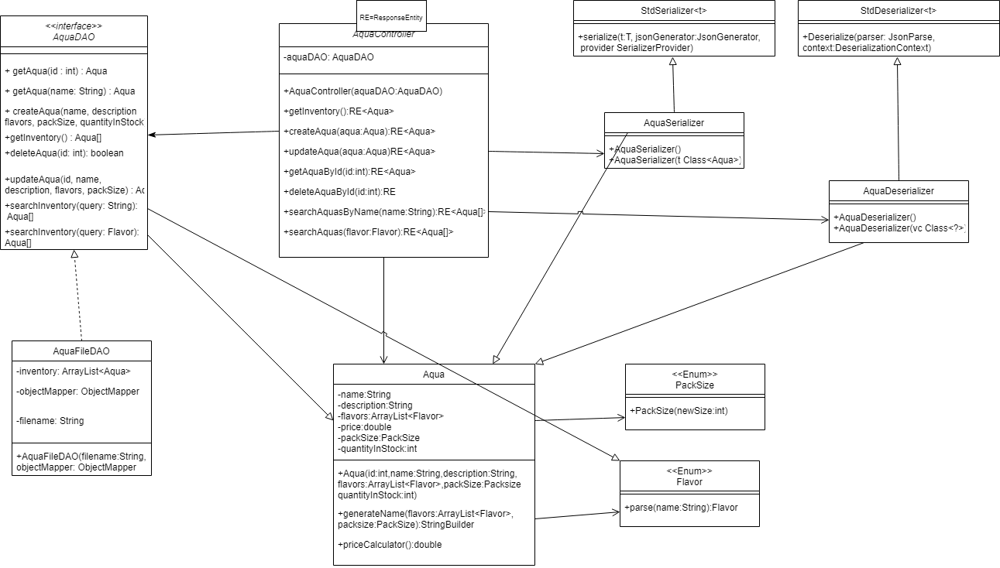

# PROJECT Design Documentation

## Team Information
* Team name: Aqua Vybes
* Team members
  * Danny G
  * Rafael G
  * Jordan Q
  * Andy W
  * Gavin H

## Executive Summary

This project is an E-commerce store designed for a small flavored water business. Written using custom software to meet custom workflow demands from the Product Owner to both meet the MVP and also fulfill the two 10% enhancement features.

### Purpose

The most important groups of users are the customers and the admin. Anyone signed in with the reserved admin username is assumed to be an admin and needs administrative access to various aspects of the site in order to adjust the product inventory, ie. create, delete or change products. The other group of users are the customers, which can create new aquas with the combination of flavors that they would like.

### Glossary and Acronyms

| Term | Definition |
|------|------------|
| SPA | Single Page |

## Requirements

A user can log in or out to the application.  An e-store owner logs in using the reserved username admin.  Any other username can be assumed to be a customer.

A customer should be able to search for a product.  A customer should be able to add or remove a product from their shopping cart.

An e-store owner can add, remove, and edit the product data in the inventory.  An e-store owner should not have access to a shopping cart.

A customer can create packs of aquas with different combinations of flavors

A customer can generate codes for an aqua and load codes to fill their aqua

### Definition of MVP

The MVP will have login/logout functionalities, customer functionality such as searching for products, listing all products, adding or removing products from their shopping cart as well as the ability to proceed to checkout the items in the cart. The MVP will also contain an inventory management system for the E-Store owners, as well as data persistence using a file system rather than dealing with the complexity of a database.  

## Application Domain

This section describes the application domain.

## Architecture and Design

This section describes the application architecture.

### Summary

The following Tiers/Layers model shows a high-level view of the webapp's architecture.

The e-store web application, is built using the Model–View–ViewModel (MVVM) architecture pattern. 

The Model stores the application data objects including any functionality to provide persistance. 

The View is the client-side SPA built with Angular utilizing HTML, CSS and TypeScript. The ViewModel provides RESTful APIs to the client (View) as well as any logic required to manipulate the data objects from the Model.

Both the ViewModel and Model are built using Java and Spring Framework. Details of the components within these tiers are supplied below.

### Overview of User Interface

The UI consists of a sign-in page, a create Aqua page, a Flavors page, a Cart page, a Pack page.
The user can navigate between these to create the products they want to add to their cart,
see the available flavors, and view their cart.

### Model Tier

The model tier contains all of the models used in our application. This includes User, Flavor and Aqua to represent user accounts, flavors and our inventory respectively. It also contains our enums used for fields like packSize as well as our FlavorInventory which models the inventory of flavors.  

## OO Design Principles

The single responsibility principle states that every class in a program should have a single, tightly-focused responsibility.  This makes it easier to understand the scope of a change in the class, easier to manage concurrent changes, and allows separate concerns to go into separate classes, allowing for a more logical structure.  In our project, the AquaController has a single responsibility: to handle API requests and respond with HTTP protocols.  It isn’t concerned with how the data is managed or stored; these responsibilities are left to the Data Access Object class.

Dependency inversion is a very easy technique to help improve loose coupling. Dependency inversion is when you take methods from a class, then move them into an interface and inherit the interface. This means that it is easier to substitute the class for a different one with the same interface. One example of this is the use of the AquaDAO interface and the AquaFileDAO class. If we needed to we could create a separate class that inherits from AquaDAO if we wanted different functionality. We also used dependency inversion with the inclusion of the serialize and deserialize classes. The parent classes creator's use of dependency inversion allows us to serialize and deserialize our JSONs very easily.

The Open Closed Principle says that “Software entities (classes, modules, functions, etc.) should be open for extension, but closed for modification”(Meyer). This means that a change in a class should not affect all of the dependent classes but you should be able to extend the classes. The problem with this is that inheriting a super class inherently makes them tightly coupled which directly contradicts the loosely coupled SOLID principle. To counteract this, the principle was later redefined to involve using interfaces as opposed to super classes to allow different implementations. We implemented this similar to dependency inversion. The DAO interface allows us flexibility in the future. 

The controller principle says that we should have a class that does the management of the system and separate it from the data or visuals. This allows objects to be more loosely coupled and makes it easier to debug. We accomplish this by having a controller class that handles all of the HTTP requests. The Controller class takes in the data object and maps each DAO function to an HTTP request, fulfilling the needs of a REST API.

## Testing

Unit tests were created for the model, persistence, and controller tiers.

### Acceptance Testing

All user stories passed their acceptance criteria tests.
### Unit Testing and Code Coverage

Our code coverage for this sprint is only 58%, as controller tests were not created.

